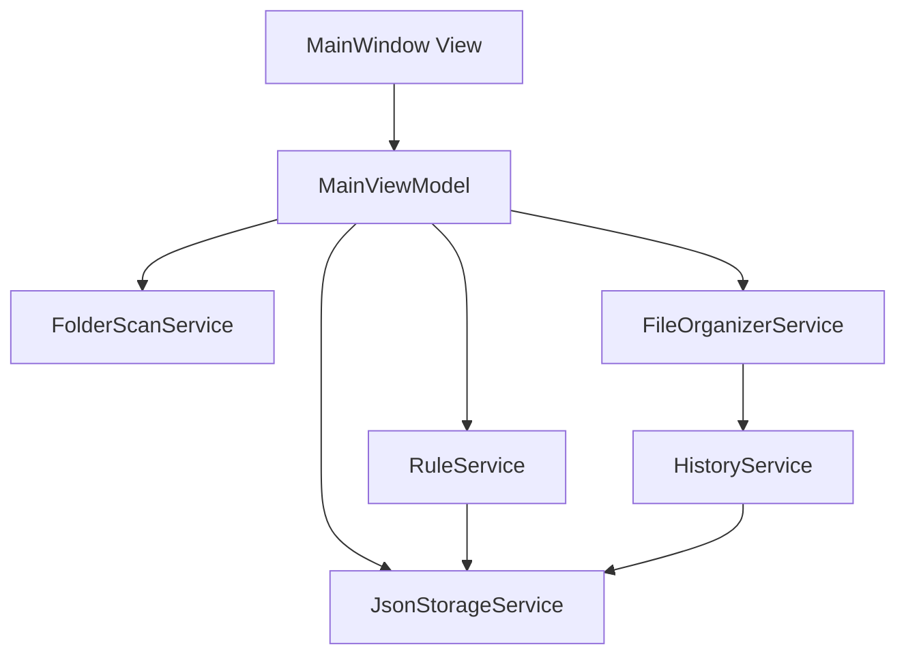

# Smart File Organizer Implementation Plan

## Architecture Overview
Use a small MVVM structure with plain services and JSON persistence. Keep business logic outside WPF views so the project stays easy to test and complete in one day.

Suggested folders:

- `Models/`
- `ViewModels/`
- `Views/`
- `Services/`
- `Data/`
- `Commands/`

## Module 1: Models

Classes:

- `FileItem`
- `OrganizationRule`
- `PreviewItem`
- `HistoryEntry`

Responsibilities:

- `FileItem`: Represents a scanned file with name, full path, extension, size, and last modified date.
- `OrganizationRule`: Represents an extension-to-folder rule, for example `.pdf -> Documents`.
- `PreviewItem`: Represents what will happen to one file before organizing: source path, destination folder, destination path, matched rule, and status.
- `HistoryEntry`: Represents one completed or failed file move with timestamp, source, destination, status, and message.

Dependencies:

- No application service dependencies.
- Uses basic .NET types like `DateTime`, `FileInfo`, and strings.

Implementation order:

1. Create `FileItem`.
2. Create `OrganizationRule`.
3. Create `PreviewItem`.
4. Create `HistoryEntry`.

## Module 2: Infrastructure And Commands

Classes:

- `ViewModelBase`
- `RelayCommand`
- Optional: `AsyncRelayCommand`

Responsibilities:

- `ViewModelBase`: Implements `INotifyPropertyChanged`.
- `RelayCommand`: Implements `ICommand` for synchronous UI actions.
- `AsyncRelayCommand`: Keeps longer actions like scanning and organizing from blocking the UI.

Dependencies:

- `System.ComponentModel`
- `System.Windows.Input`
- Optional: `System.Threading.Tasks`

Implementation order:

1. Create `ViewModelBase`.
2. Create `RelayCommand`.
3. Add `AsyncRelayCommand` only if scan/organize methods are async.

## Module 3: JSON Storage

Classes:

- `JsonStorageService`
- Optional: `AppDataPaths`

Responsibilities:

- `JsonStorageService`: Generic read/write helper for JSON files.
- Stores rules in `rules.json`.
- Stores history in `history.json`.
- Creates the app data folder if it does not exist.
- Returns empty lists when JSON files do not exist yet.

Dependencies:

- `System.Text.Json`
- `System.IO`
- Used by `RuleService` and `HistoryService`.

Implementation order:

1. Create app data path helper or constants.
2. Implement `LoadAsync<T>()`.
3. Implement `SaveAsync<T>()`.
4. Test by saving and loading an empty rule list.

## Module 4: Rule Management

Classes:

- `RuleService`
- `RuleViewModel` or direct binding to `OrganizationRule`

Responsibilities:

- Loads saved rules from JSON.
- Adds new extension-based rules.
- Removes selected rules.
- Normalizes extensions so users can enter either `pdf` or `.pdf`.
- Prevents duplicate extension rules.
- Saves rules after changes.

Dependencies:

- `JsonStorageService`
- `OrganizationRule`

Implementation order:

1. Implement rule loading.
2. Implement extension normalization.
3. Implement add/remove rule methods.
4. Persist changes to `rules.json`.
5. Bind rules to the UI.

## Module 5: Folder Scanning

Classes:

- `FolderScanService`

Responsibilities:

- Scans selected folder for files.
- Converts each file into a `FileItem`.
- Keeps scanning simple: scan only the selected folder by default, not subfolders.
- Optionally add an `IncludeSubfolders` boolean if time allows.
- Handles inaccessible files gracefully by skipping them or reporting a message.

Dependencies:

- `System.IO`
- `FileItem`

Implementation order:

1. Implement scan selected folder only.
2. Return `List<FileItem>`.
3. Add basic error handling.
4. Add optional recursive scan only after the main flow works.

## Module 6: Preview Generation

Classes:

- `PreviewService` or method inside `FileOrganizerService`

Responsibilities:

- Matches scanned files against rules by extension.
- Computes destination folder path under the selected root folder.
- Produces `PreviewItem` records.
- Marks files with no matching rule as `NoRule` so they are not moved.
- Detects possible destination conflicts when a file already exists.

Dependencies:

- `FileItem`
- `OrganizationRule`
- `PreviewItem`
- `System.IO`

Implementation order:

1. Match files to rules by extension.
2. Build destination paths.
3. Mark unmatched files.
4. Add simple conflict detection.
5. Bind preview results to UI.

## Module 7: File Organization

Classes:

- `FileOrganizerService`

Responsibilities:

- Moves files from source path to preview destination path.
- Creates destination folders if needed.
- Skips files with no matching rule.
- Skips or marks conflicts instead of overwriting files.
- Returns `HistoryEntry` records for success and failure.

Dependencies:

- `PreviewItem`
- `HistoryEntry`
- `System.IO`

Implementation order:

1. Move only preview items with valid destination paths.
2. Create destination folders.
3. Skip existing destination files.
4. Return history entries.
5. Refresh scan and preview after organizing.

## Module 8: History Logging

Classes:

- `HistoryService`

Responsibilities:

- Loads existing history from JSON.
- Appends new history entries after organize operation.
- Saves history back to `history.json`.
- Provides clear status values such as `Moved`, `Skipped`, and `Failed`.

Dependencies:

- `JsonStorageService`
- `HistoryEntry`

Implementation order:

1. Load history on app startup.
2. Append results after organizing.
3. Save to `history.json`.
4. Bind recent history to UI.

## Module 9: Main ViewModel

Classes:

- `MainViewModel`

Responsibilities:

- Holds selected folder path.
- Holds observable collections for scanned files, rules, preview items, and history.
- Exposes commands:
  - `SelectFolderCommand`
  - `ScanCommand`
  - `AddRuleCommand`
  - `RemoveRuleCommand`
  - `GeneratePreviewCommand`
  - `OrganizeCommand`
- Coordinates services.
- Exposes simple status text for the UI.

Dependencies:

- `FolderScanService`
- `RuleService`
- `FileOrganizerService`
- `HistoryService`
- Optional `PreviewService`
- `ObservableCollection<T>`

Implementation order:

1. Create constructor and inject/create services.
2. Load rules and history.
3. Implement folder selection.
4. Implement scan command.
5. Implement add/remove rule commands.
6. Implement preview command.
7. Implement organize command.
8. Add status messages.

## Module 10: WPF Views

Classes / files:

- `MainWindow.xaml`
- `MainWindow.xaml.cs`
- Optional: `App.xaml`

Responsibilities:

- Provides a simple single-window interface.
- Lets user select a folder.
- Shows scanned files.
- Lets user add/remove rules.
- Shows preview destination paths.
- Lets user click Organize.
- Shows history log.

Recommended layout:

- Top row: selected folder textbox and Browse button.
- Left panel: scanned files list.
- Middle panel: rules list and add/remove controls.
- Right panel: preview list.
- Bottom panel: history and status message.

Dependencies:

- `MainViewModel`
- WPF binding
- `Microsoft.Win32` or `System.Windows.Forms.FolderBrowserDialog` for folder selection.

Implementation order:

1. Build static layout.
2. Bind `DataContext` to `MainViewModel`.
3. Bind folder path and commands.
4. Bind files, rules, preview, and history collections.
5. Add basic validation messages.

## One-Day Build Sequence

1. Create .NET 8 WPF project and folders.
2. Implement models.
3. Implement `ViewModelBase` and commands.
4. Implement JSON storage.
5. Implement rule loading/saving.
6. Implement folder scanning.
7. Implement preview generation.
8. Implement file moving and history logging.
9. Implement `MainViewModel` coordination.
10. Build the single `MainWindow.xaml` UI.
11. Manually test with a temporary folder and sample files.
12. Polish labels, status messages, and error handling.

## Recommended Simplicity Rules

- Use one main window only.
- Store data in two JSON files only: `rules.json` and `history.json`.
- Do not use a database.
- Do not implement drag-and-drop unless extra time remains.
- Do not overwrite existing files; mark them as skipped.
- Scan only the selected folder first; recursive scanning is optional.
- Keep rule format simple: extension plus destination folder name.

## Minimal Completion Criteria

The project is complete when:

- User can select a folder.
- Files are listed after scan.
- User can add and remove extension rules.
- Preview shows where matching files will move.
- Organize moves files into destination folders.
- History records are displayed and saved.
- Rules and history reload after restarting the app.